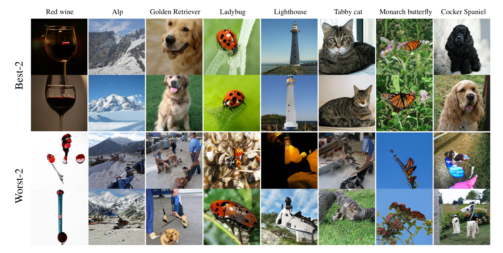

## Improved Precision and Recall Metric for Assessing Generative Models &mdash; Official TensorFlow Implementation 



**Picture:** *Low and high quality BigGAN samples according to our realism score. Images were selected from 1000 non-truncated samples.*

> **Improved Precision and Recall Metric for Assessing Generative Models**<br>
> Tuomas Kynkäänniemi, Tero Karras, Samuli Laine, Jaakko Lehtinen, and Timo Aila<br>
> [Paper (arXiv)](https://arxiv.org/abs/1904.06991)
>
> **Abstract:** *The ability to evaluate the performance of a computational model is a vital requirement for driving algorithm research. This is often particularly difficult for generative models such as generative adversarial networks (GAN) that model a data manifold only specified indirectly by a finite set of training examples. In the common case of image data, the samples live in a high-dimensional embedding space with little structure to help assessing either the overall quality of samples or the coverage of the underlying manifold. We present an evaluation metric with the ability to separately and reliably measure both of these aspects in image generation tasks by forming explicit non-parametric representations of the manifolds of real and generated data. We demonstrate the effectiveness of our metric in StyleGAN and BigGAN by providing several illustrative examples where existing metrics yield uninformative or contradictory results. Furthermore, we analyze multiple design variants of StyleGAN to better understand the relationships between the model architecture, training methods, and the properties of the resulting sample distribution. In the process, we identify new variants that improve the state-of-the-art. We also perform the first principled analysis of truncation methods and identify an improved method. Finally, we extend our metric to estimate the perceptual quality of individual samples, and use this to study latent space interpolations.*

## Usage

This repository provides code for reproducing StyleGAN truncation sweep and realism score experiments. This code was tested with Python 3.6, Tensorflow 1.12 and NVIDIA V100 GPU.

To run the below code examples, you need to obtain the FFHQ dataset in TFRecords format.  You can download it from [Flickr-Faces-HQ repository](http://stylegan.xyz/ffhq).

### Truncation sweep

Precision and Recall during StyleGAN truncation sweep can be evaluated with:

```
python run_metric.py --data_dir <path_to_ffhq_tfrecords> --truncation_sweep
```

Running the above command takes approximately 30 minutes per iteration and it outputs results to `stylegan_truncation.txt` file.

### Realism score

Evaluation of realism score using StyleGAN and FFHQ dataset can be run with:

```
python run_metric.py --data_dir <path_to_ffhq_tfrecords> --realism_score
```

Running the above command takes approximately 15 minutes and it saves 25 low and high quality samples ranked according to our realism score.

## Licenses

All material is made available under [Creative Commons BY-NC 4.0](https://creativecommons.org/licenses/by-nc/4.0/)license by NVIDIA Corporation. You can **use, redistribute, and adapt** the material for **non-commercial purposes**, as long as you give appropriate credit by **citing our paper** and **indicating any changes** that you've made.

`karras2019stylegan-ffhq-1024x1024.pkl` is by Tero Karras, Samuli Laine and Timo Aila.
The network was originally shared under Creative Commons BY 4.0 license on [Style-Based Generator
Architecture for Generative Adversarial Networks](https://github.com/NVlabs/stylegan) project page.

`vgg16.pkl` is derived from the pre-trained [VGG-16](https://arxiv.org/abs/1409.1556) network by Karen Simonyan and Andrew Zisserman. The network was originally shared under [Creative Commons BY 4.0](https://creativecommons.org/licenses/by/4.0/) license on the [Very Deep Convolutional Networks for Large-Scale Visual Recognition](http://www.robots.ox.ac.uk/~vgg/research/very_deep/) project page.

## Acknowledgements

We thank David Luebke for helpful comments; Janne Hellsten, and Tero Kuosmanen for compute infrastructure.

## Citation

To cite our work, please use:

```
@article{Kynkaanniemi2019,
  author    = {Tuomas Kynkäänniemi and Tero Karras
               and Samuli Laine and Jaakko Lehtinen
               and Timo Aila},
  title     = {Improved Precision and Recall Metric for Assessing Generative Models},
  journal   = {CoRR},
  volume    = {abs/1904.06991},
  year      = {2019},
}
```
